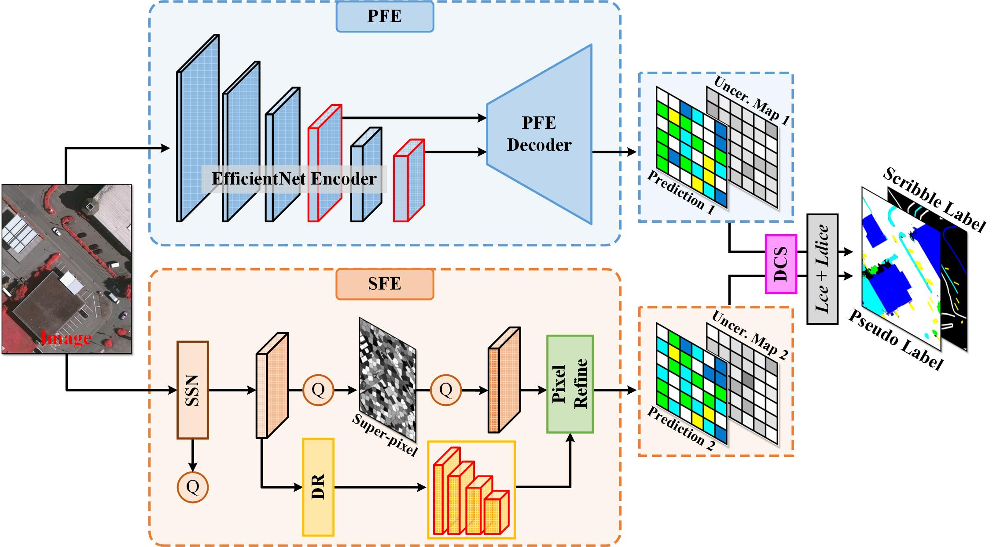
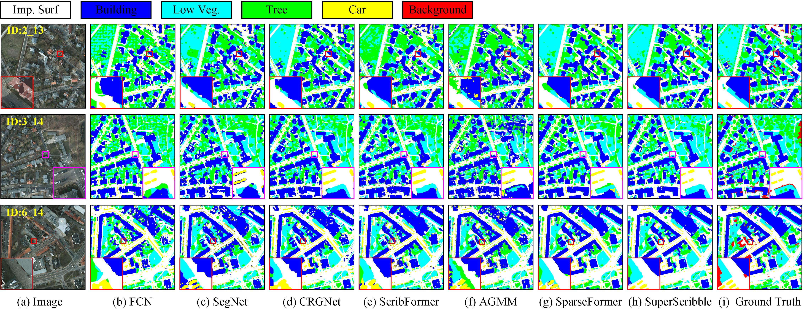
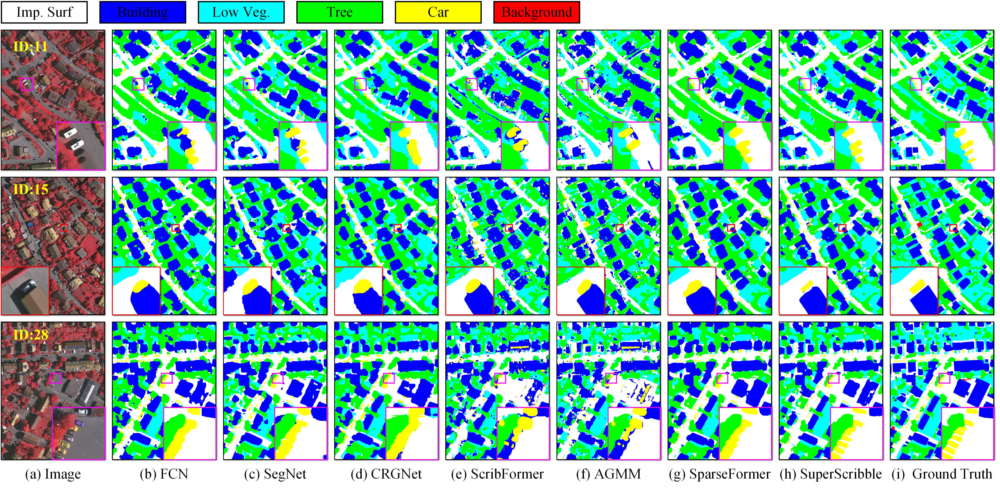
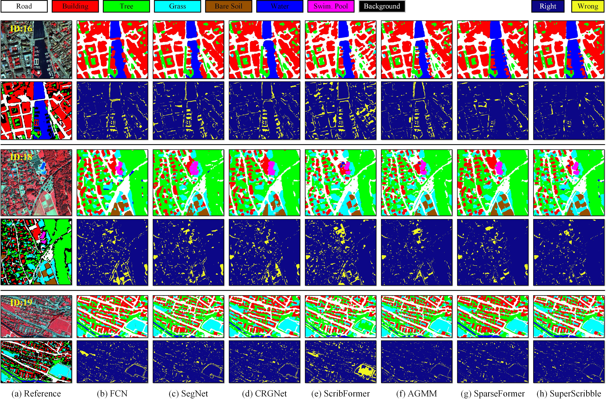
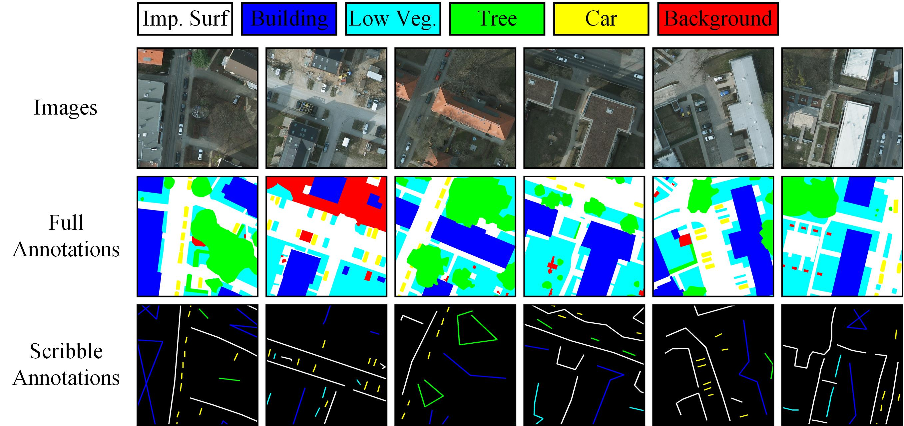
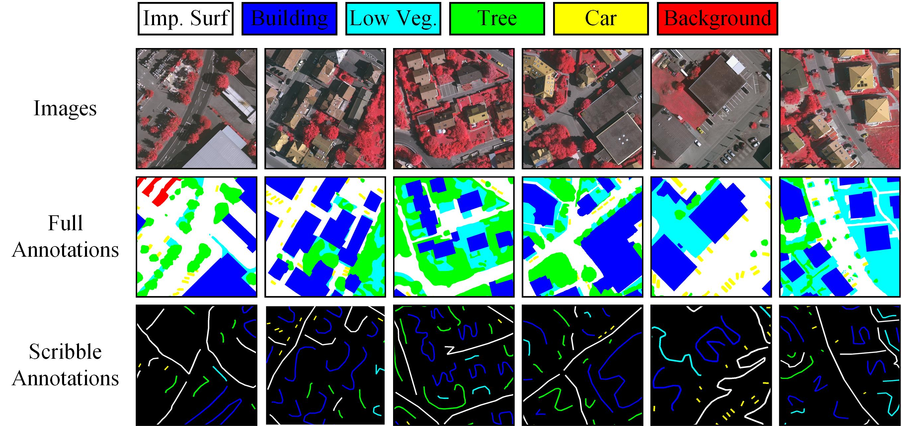
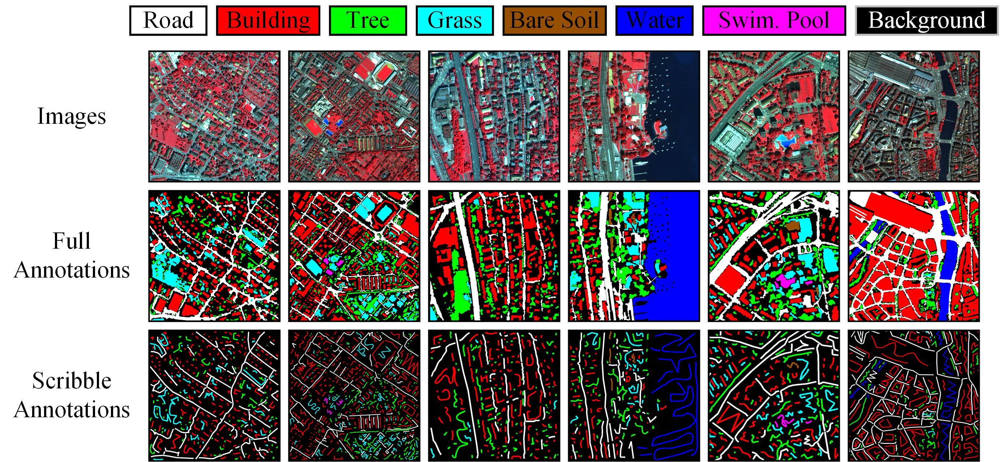

<h2 align="center">[TGRS 2026] SuperScribble: A Super-pixel and Pixel Dual Constraint Remote Sensing Image Semantic Segmentation Network With Scribble Annotation</h2>

<p align="center">
<a href="https://ieeexplore.ieee.org/document/11503432">
📄 Paper Link
</a>
</p>

<p align="center">
<strong>Anqi Zhao</strong><sup>1</sup>, 
<strong>Hongjin Wang</strong><sup>1</sup>, 
<strong>Xinghua Li</strong><sup>1</sup>, 
<strong>Huanfeng Shen</strong><sup>2</sup>
</p>

<p align="center">
<sup>1</sup> School of Remote Sensing and Information Engineering, Wuhan University <br>
<sup>2</sup> School of Resource and Environmental Science, Wuhan University
</p>


</div>

<p align="center">
    
</p>

---

## 📚 Table of Contents

* [Visual Results](#visual_results)
* [Code](#code)
* [Installation](#installation)
* [Dataset](#dataset)
* [Train and Test](#train_and_test)
* [Citation](#citation)
* [Acknowledgements](#acknowledgements)
* [Contact](#contact)

---

## <a name="visual_results"></a>👁️ Visual Results

### (1) Results for Potsdam



### (2) Results for Vaihingen



### (3) Results for Zurich Summer



---

## <a name="code"></a>🧬 Code

Download the SuperScribble code from the link below:

(https://pan.baidu.com/s/1APkgO3g0dKOVgcb_dKFlWw?pwd=yupg,  code:yupg)

---

## <a name="installation"></a>⚙️ Installation
```bash

# Create a conda environment with Python >= 3.7
conda create -n SuperScribble python=3.7
conda activate SuperScribble

# Install required packages
pip install -r requirements.txt

# for super-pixel branch (SSN), please wait for about 5 minutes
cd SSN/lib
. install.sh
```

For super-pixel branch, you can also refer to <a href="https://github.com/Bobholamovic/ESCNet"> ESCNet </a> or  <a href="https://github.com/immortal13/LESSFormer-hyperspectral-image-classification">LESSFormer </a> for the compiling process.

---


## <a name="dataset"></a>📊 Dataset

The experiments are conducted based on three public datasets, namely Potsdam, Vaihingen and Zurich Summer datasets. We share scribble annotations for these three datasets in `/data`. For full annotations, please download them yourself.

### (1) Potsdam

<p align="center">
    
</p>

### (2) Vaihingen
<p align="center">
    
</p>

### (3) Zurich Summer
<p align="center">
    
</p>

---

## <a name="train_and_test"></a>:stars:Train and Test


```bash
python Train.py
```
```bash
python Test.py
```

---


## <a name="citation"></a>📖 Citation

If you find this work helpful, please consider citing:

```bibtex
@misc{11503432,
  author={Zhao, Anqi and Wang, Hongjin and Li, Xinghua and Shen, Huanfeng},
  journal={IEEE Transactions on Geoscience and Remote Sensing}, 
  title={SuperScribble: A Super-Pixel and Pixel Dual Constraint Remote Sensing Image Semantic Segmentation Network With Scribble Annotation}, 
  year={2026},
  volume={64},
  number={},
  pages={5620113-5620113},
  keywords={Satellite images;Earth Observing System;Feeds;Circuits;Pixel;Mobile ad hoc networks;Ad hoc networks;Electronic mail;Digital images;Video equipment;Remote sensing images (RSIs);scribble annotation;semantic segmentation;weakly supervised},
  doi={10.1109/TGRS.2026.3689583}}
```

---

## <a name="acknowledgements"></a>🙏 Acknowledgements

This project is based on [SparseFormer](https://github.com/Yujia73/SparseFormer) and [ESCNet](https://github.com/Bobholamovic/ESCNet). We thank the authors for their excellent work.

---

## <a name="contact"></a>📨 Contact

If you have any questions, feel free to reach out to:
**Xinghua Li** — [lixinghua5540@whu.edu.cn](mailto:lixinghua5540@whu.edu.cn)
**Anqi Zhao** — [zhaoanqi@whu.edu.cn](mailto:zhaoanqi@whu.edu.cn)
